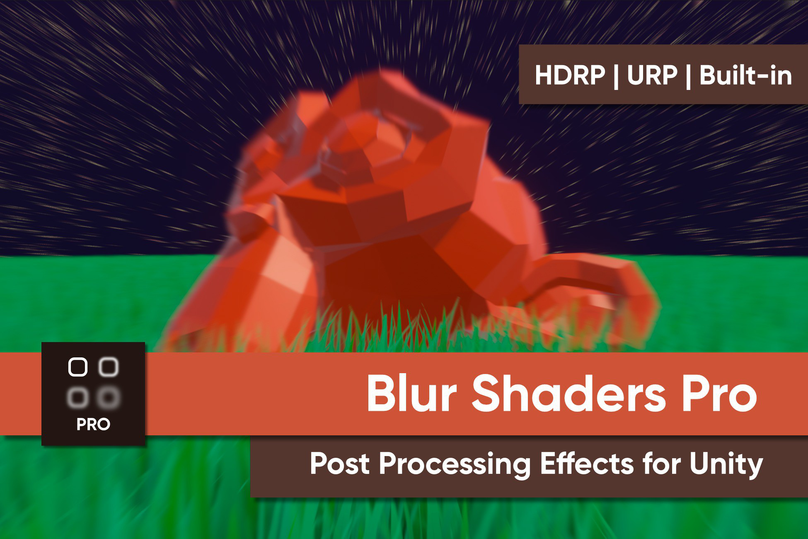

# Blur Shaders Pro (URP)

A small collection of blur post processing effects for Unity URP.

## Overview

This repository contains the code for my asset pack, *Blur Shaders Pro for Unity*, which is being discontinued. It comes with Gaussian, Box, and Radial blur variants and it supports Unity versions from 2022.3 until 6.3. Support for versions 6.4 and beyond is not guaranteed.

## Authors

This asset pack was created by Daniel Ilett.

## Release

This asset is being made free on April 20th 2026.
